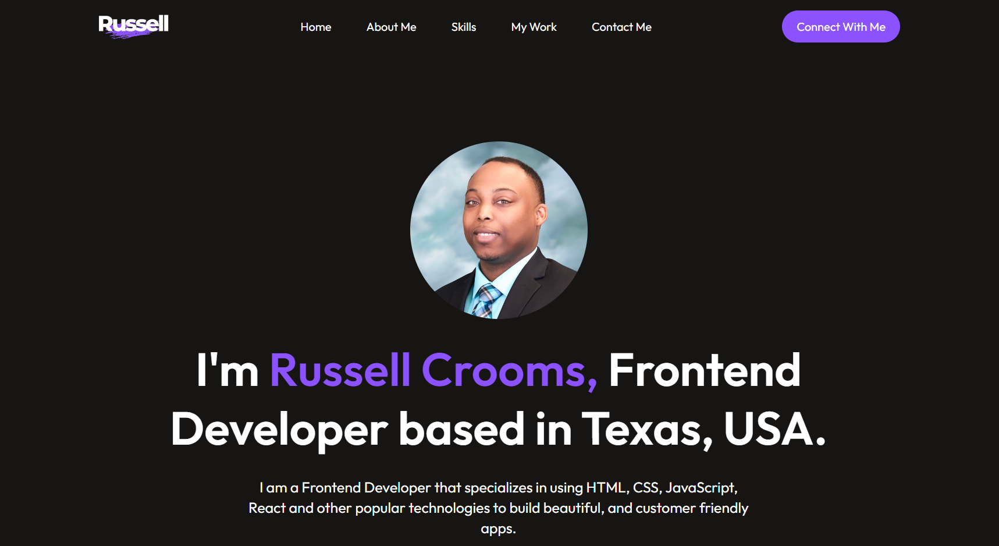

## Russell Crooms - A Showcase of My Work
>
## Overview 
> 
> This website is my personal portfolio, built with React JS, JavaScript, HTML, and CSS. It aims to showcase my skills, projects, and educational journey as a web developer. 
> 
> 
>
## Technologies Used
> 
> Frontend
> - React JS
> - JavaScript
> - HTML 
> - CSS
> 
## Project Goals 
> 
> Develop a visually appealing and user-friendly platform to display my work experience and projects. 
> Implement interactive elements to demonstrate JavaScript expertise. 
> Utilize React components and best practices for a well-structured and maintainable codebase. 
> Improve my skills in front-end development technologies. 
>
>
## Getting Started 
>
> If you'd like to explore the codebase locally, follow these steps: 
> 1. Clone the Repository: Use git to clone this repository to your machine. 
> 2. Install Dependencies: Navigate to the project directory and run `npm install`
> 3. Start the Development Server: Run `npm run dev` to launch the development server and view the website locally (usually at http://localhost:3000). 
>
> 
## Deployment 
> 
> Coming soon.

